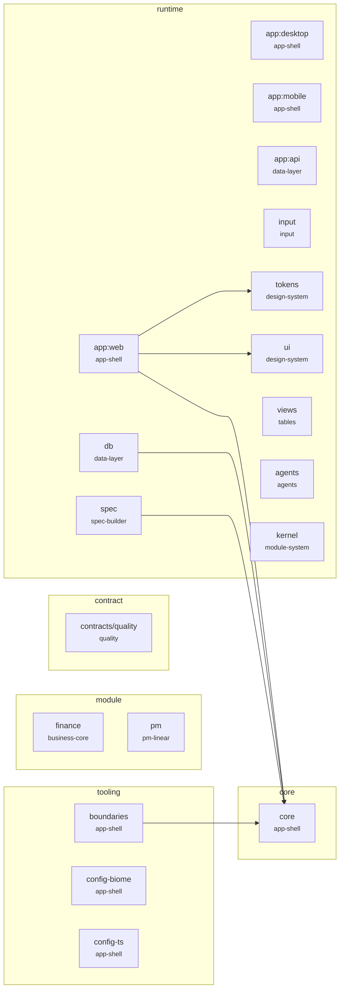
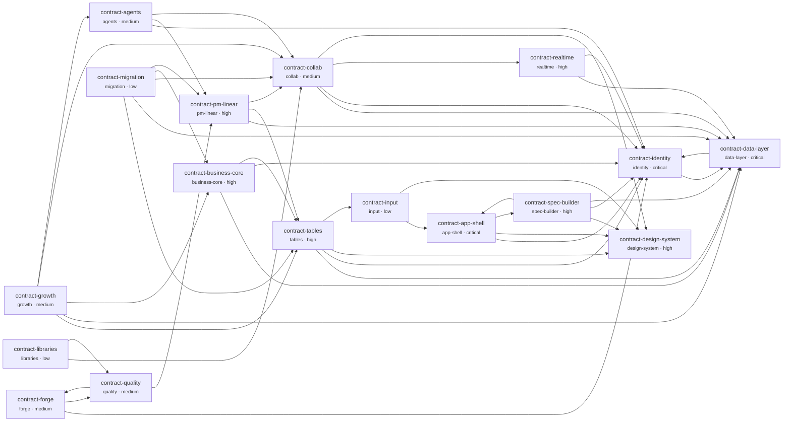

<!-- GENERATED FILE — do not edit. Written by `pnpm gen:dep-map` (PAP-305, ADR 0026). -->

# Dependency map

Generated from `ownership.json` and the import graph of the working tree.
Run `pnpm gen:dep-map` after any import or ownership change and commit both files;
`pnpm lint:deps` and the `@paperos/boundaries` tests fail when the committed copy is stale.

Packages on disk today: **19**. Import edges: **6**, of them undeclared: **0**.

## Imports today

Solid arrows are imports `ownership.json` allows; thick arrows are undeclared dependencies.

## Contract graph

## Undeclared dependencies

None. Every import in the tree is covered by `allowedDeps`.

## Owners

| Directory | Kind | Owner | Optional | On disk | Issues |
| -- | -- | -- | -- | -- | -- |
| `apps/web` | runtime | app-shell | no | yes | PAP-13, PAP-16, PAP-18 |
| `apps/desktop` | runtime | app-shell | no | yes | PAP-19 |
| `apps/mobile` | runtime | app-shell | no | yes | PAP-20 |
| `apps/api` | runtime | data-layer | no | yes | PAP-267 |
| `apps/worker` | runtime | data-layer | no | planned | PAP-43 |
| `apps/collab-server` | runtime | realtime | no | planned | PAP-140 |
| `packages/core` | core | app-shell | no | yes | PAP-13 |
| `packages/core/src/audience` | core | identity | no | planned | PAP-55 |
| `packages/core/src/config` | core | app-shell | no | yes | PAP-17 |
| `packages/core/src/devices` | core | app-shell | no | yes | PAP-14 |
| `packages/core/src/events` | core | data-layer | no | yes | PAP-555 |
| `packages/core/src/filter` | core | data-layer | no | yes | PAP-279 |
| `packages/core/src/flags` | core | app-shell | no | planned | PAP-366 |
| `packages/core/src/i18n` | core | app-shell | no | planned | PAP-27 |
| `packages/core/src/modules` | core | app-shell | no | yes | PAP-264, PAP-305, PAP-433 |
| `packages/core/src/native` | core | app-shell | no | planned | PAP-259 |
| `packages/core/src/nav` | core | app-shell | no | planned | PAP-16 |
| `packages/core/src/pwa` | core | app-shell | no | planned | PAP-18 |
| `packages/core/src/types` | core | data-layer | no | planned | PAP-302 |
| `packages/core/src/windows` | core | app-shell | no | planned | PAP-21 |
| `packages/api-client` | runtime | data-layer | no | planned | PAP-268 |
| `packages/api-contract` | runtime | data-layer | no | planned | PAP-268 |
| `packages/auth` | runtime | identity | no | planned | PAP-57 |
| `packages/db` | runtime | data-layer | no | yes | PAP-32, PAP-33, PAP-34, PAP-38 |
| `packages/email` | runtime | data-layer | no | planned | PAP-43 |
| `packages/files` | runtime | data-layer | no | planned | PAP-37 |
| `packages/input` | runtime | input | no | yes | PAP-150 |
| `packages/jobs` | runtime | data-layer | no | planned | PAP-43 |
| `packages/permissions` | runtime | identity | no | planned | PAP-59, PAP-60 |
| `packages/search` | runtime | data-layer | no | planned | PAP-39 |
| `packages/spec` | runtime | spec-builder | no | yes | PAP-114 |
| `packages/sync` | runtime | data-layer | no | planned | PAP-36, PAP-270, PAP-271, PAP-272 |
| `packages/tokens` | runtime | design-system | no | yes | PAP-66 |
| `packages/ui` | runtime | design-system | no | yes | PAP-67, PAP-74 |
| `packages/views` | runtime | tables | no | yes | PAP-161 |
| `packages/agents` | runtime | agents | no | yes | PAP-103, PAP-108 |
| `packages/kernel` | runtime | module-system | no | yes | PAP-434 |
| `packages/collab` | module | collab | yes | planned | PAP-128, PAP-131, PAP-141, PAP-145 |
| `packages/crm` | module | growth | yes | planned | PAP-187 |
| `packages/finance` | module | business-core | yes | yes | PAP-175 |
| `packages/import` | module | migration | yes | planned | PAP-199 |
| `packages/pm` | module | pm-linear | yes | yes | PAP-100, PAP-305 |
| `packages/contracts/quality` | contract | quality | no | yes | PAP-79, PAP-239 |
| `packages/boundaries` | tooling | app-shell | no | yes | PAP-305 |
| `packages/config-biome` | tooling | app-shell | no | yes | PAP-13 |
| `packages/config-ts` | tooling | app-shell | no | yes | PAP-13 |

## Allowed dependency graph

| Package | May import |
| -- | -- |
| `apps/web` | `packages/core`, `packages/tokens`, `packages/ui`, `packages/spec`, `packages/views`, `packages/sync`, `packages/api-client`, `packages/api-contract`, `packages/auth`, `packages/permissions`, `packages/collab`, `packages/kernel`, `packages/files`, `packages/search`, `packages/contracts/quality` |
| `apps/desktop` | `packages/core`, `packages/tokens`, `packages/ui`, `packages/spec`, `packages/views`, `packages/sync`, `packages/api-client`, `packages/api-contract`, `packages/auth`, `packages/permissions`, `packages/collab`, `packages/kernel`, `packages/files`, `packages/search`, `packages/contracts/quality` |
| `apps/mobile` | `packages/core`, `packages/tokens`, `packages/ui`, `packages/spec`, `packages/views`, `packages/sync`, `packages/api-client`, `packages/api-contract`, `packages/auth`, `packages/permissions`, `packages/collab`, `packages/kernel`, `packages/files`, `packages/search`, `packages/contracts/quality` |
| `apps/api` | `packages/core`, `packages/db`, `packages/api-contract`, `packages/auth`, `packages/permissions`, `packages/jobs`, `packages/files`, `packages/search`, `packages/email`, `packages/sync`, `packages/kernel`, `packages/contracts/quality` |
| `apps/worker` | `packages/core`, `packages/db`, `packages/jobs`, `packages/files`, `packages/search`, `packages/email`, `packages/kernel`, `packages/contracts/quality` |
| `apps/collab-server` | `packages/core`, `packages/db`, `packages/auth`, `packages/permissions`, `packages/kernel`, `packages/contracts/quality` |
| `packages/core` | — (nothing) |
| `packages/api-client` | `packages/core`, `packages/api-contract`, `packages/contracts/quality` |
| `packages/api-contract` | `packages/core`, `packages/contracts/quality` |
| `packages/auth` | `packages/core`, `packages/db`, `packages/contracts/quality` |
| `packages/db` | `packages/core`, `packages/contracts/quality` |
| `packages/email` | `packages/core`, `packages/db`, `packages/jobs`, `packages/files`, `packages/contracts/quality` |
| `packages/files` | `packages/core`, `packages/db`, `packages/jobs`, `packages/contracts/quality` |
| `packages/input` | `packages/core`, `packages/tokens`, `packages/contracts/quality` |
| `packages/jobs` | `packages/core`, `packages/db`, `packages/contracts/quality` |
| `packages/permissions` | `packages/core`, `packages/db`, `packages/auth`, `packages/contracts/quality` |
| `packages/search` | `packages/core`, `packages/db`, `packages/jobs`, `packages/contracts/quality` |
| `packages/spec` | `packages/core`, `packages/tokens`, `packages/ui`, `packages/contracts/quality` |
| `packages/sync` | `packages/core`, `packages/db`, `packages/contracts/quality` |
| `packages/tokens` | `packages/contracts/quality` |
| `packages/ui` | `packages/core`, `packages/tokens`, `packages/contracts/quality` |
| `packages/views` | `packages/core`, `packages/db`, `packages/tokens`, `packages/ui`, `packages/contracts/quality` |
| `packages/agents` | `packages/core`, `packages/contracts/quality` |
| `packages/kernel` | `packages/core`, `packages/contracts/quality` |
| `packages/collab` | `packages/core`, `packages/db`, `packages/ui`, `packages/spec`, `packages/views`, `packages/sync`, `packages/api-contract`, `packages/permissions`, `packages/jobs`, `packages/files`, `packages/search`, `packages/email`, `packages/tokens`, `packages/contracts/quality` |
| `packages/crm` | `packages/core`, `packages/db`, `packages/ui`, `packages/spec`, `packages/views`, `packages/sync`, `packages/api-contract`, `packages/permissions`, `packages/jobs`, `packages/files`, `packages/search`, `packages/email`, `packages/contracts/quality` |
| `packages/finance` | `packages/core`, `packages/db`, `packages/ui`, `packages/spec`, `packages/views`, `packages/sync`, `packages/api-contract`, `packages/permissions`, `packages/jobs`, `packages/files`, `packages/search`, `packages/email`, `packages/contracts/quality` |
| `packages/import` | `packages/core`, `packages/db`, `packages/ui`, `packages/spec`, `packages/views`, `packages/sync`, `packages/api-contract`, `packages/permissions`, `packages/jobs`, `packages/files`, `packages/search`, `packages/email`, `packages/contracts/quality` |
| `packages/pm` | `packages/core`, `packages/db`, `packages/ui`, `packages/spec`, `packages/views`, `packages/sync`, `packages/api-contract`, `packages/permissions`, `packages/jobs`, `packages/files`, `packages/search`, `packages/email`, `packages/contracts/quality` |
| `packages/contracts/quality` | `packages/core` |
| `packages/boundaries` | `packages/core` |
| `packages/config-biome` | — (nothing) |
| `packages/config-ts` | — (nothing) |
